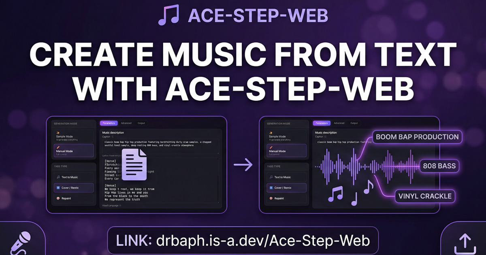

# ACE-Step-Web

A modern, dark-themed web interface for [ACE-Step](https://acemusic.ai) AI music generation.



## Features

### UI/UX
- 🎨 Modern glassmorphism dark theme with purple accents
- 📱 Fully responsive design
- 🎵 Music note logo with gradient
- 🔑 Key icon for API settings
- 🐙 GitHub link in header
- 🚫 No blue tap/click highlights
- 📜 Custom styled scrollbars

### Generation Modes
- **Sample Mode**: AI generates caption, lyrics, and metadata from a simple description
- **Manual Mode**: Full control over all parameters

### Task Types
- **Text-to-Music**: Generate music from text descriptions
- **Cover/Remix**: Upload source audio and create covers or remixes
- **Repaint**: Regenerate specific time ranges within a track

### Examples (14 Genres)
6 visible + 8 more with "Show More" button:
- 🎸 Funk Rock
- 🎤 Hip Hop (full song structure)
- 🎹 Electronic
- 🤘 Heavy Metal
- ✨ Synthpop
- ☕ Lo-Fi
- 🎷 Jazz
- 🤠 Country
- 🔊 Dubstep
- 🥁 Drum & Bass
- 👻 Phonk
- 🖤 Post-Punk
- 🎻 Symphonic Metal
- 🎮 Chiptune

### Output Tab
- 💾 Auto-saves generations to browser localStorage (up to 50)
- ⏰ Timestamps for each generation
- 📝 Expandable caption and lyrics
- 🗑️ Delete individual generations
- 🧹 Clear All with confirmation modal (red "Yes" button)
- 🎧 Built-in audio player

### Tooltips
- Hover over ⓘ icons for detailed explanations of each parameter

### API Connection
- **Worker Mode (Rate Limited)**: Uses shared Cloudflare Worker - API key hidden from users
- **Custom API Key**: Users can enter their own ACE-Step API key

### Progress Indicators
- Animated loading state on generate button
- Status text with progress messages
- Toast notifications for success/error

### SEO & Social
- Full Open Graph meta tags
- Twitter Card support
- Canonical URL
- 1200x630 OG image support
- PWA-ready meta tags

## Live Demo

🌐 [https://drbaph.is-a.dev/Ace-Step-Web/](https://drbaph.is-a.dev/Ace-Step-Web/)

## Quick Deploy

### 1. Deploy Cloudflare Worker

1. Go to [dash.cloudflare.com](https://dash.cloudflare.com) → Workers & Pages
2. Create a new worker named `ace-step`
3. Paste the code from `worker/index.js`
4. Add secret variable: `ACESTEP_API_KEY` with your API key
5. Deploy

### 2. Deploy to GitHub Pages

1. Push this repo to GitHub
2. Go to **Settings** → **Pages**
3. Source: **GitHub Actions**
4. (Optional) Add custom domain in **Custom domain** field
5. The workflow auto-deploys on push to `main`

For custom domain, add a `CNAME` file with your domain:
```
drbaph.is-a.dev
```

## Local Development

```bash
# Python
python -m http.server 8000

# Node.js
npx serve
```

Open `http://localhost:8000`

## Cloudflare Worker Setup

### Option 1: Dashboard
1. Go to [dash.cloudflare.com](https://dash.cloudflare.com) → Workers & Pages
2. Click "Create" → "Create Worker"
3. Name it `ace-step` and deploy
4. Click "Edit code" and paste contents of `worker/index.js`
5. Go to Settings → Variables → Add `ACESTEP_API_KEY` as **Secret**
6. Save and Deploy

### Option 2: CLI
```bash
cd worker
npm install -g wrangler
wrangler login
wrangler deploy
wrangler secret put ACESTEP_API_KEY
```

## Usage

### Sample Mode (Recommended for Beginners)
1. Select "Sample Mode"
2. Describe the music (e.g., "a funk rock song with groovy bass")
3. Choose vocal language
4. Toggle "Instrumental Only" if needed
5. Click "Generate Music"

### Manual Mode (Full Control)
1. Select "Manual Mode"
2. Write caption (music style description)
3. Add lyrics with `[Verse]`, `[Chorus]` tags
4. Adjust BPM, key, duration (or let AI decide)
5. Click "Generate Music"

### Cover / Remix
1. Select "Cover / Remix" task type
2. Upload source audio
3. Adjust:
   - **Cover Strength**: How much to transform (0 = clean, 1 = heavy)
   - **Remix Strength**: How much original to preserve
4. Optionally add reference audio for style guidance
5. Generate

### Repaint
1. Select "Repaint" task type
2. Upload source audio
3. Set start/end time for the section to regenerate
4. Provide new caption/lyrics for that section
5. Generate

## Parameters Reference

### Basic
| Parameter | Description |
|-----------|-------------|
| Sample Query | Natural language description for AI to generate everything |
| Caption | Music style / genre description |
| Lyrics | Song lyrics with `[Verse]`, `[Chorus]` tags |
| Vocal Language | 50+ supported languages |
| BPM | Beats per minute (0 = auto) |
| Key | Musical key (e.g., C major) |
| Duration | Length in seconds (-1 = auto) |
| Time Signature | e.g., 4, 3, 6 |

### Advanced (LM Settings)
| Parameter | Default | Description |
|-----------|---------|-------------|
| Seed | -1 | Random seed (-1 = random) |
| Temperature | 0.85 | Sampling randomness |
| Thinking Mode | On | 5Hz LM audio code generation |
| CoT Caption | On | LLM rewrites caption via chain-of-thought |
| CoT Language | On | Auto-detect vocal language |
| LM CFG Scale | 2.0 | Classifier-free guidance |
| LM Top-P | 0.9 | Nucleus sampling |
| LM Top-K | 0 | Top-k sampling (0 = disabled) |

### Advanced (DiT Settings)
| Parameter | Default | Description |
|-----------|---------|-------------|
| Guidance Scale | 7.0 | Diffusion guidance |
| Inference Steps | 8 | More steps = higher quality (turbo = 8) |
| Inference Method | ODE | ODE or SDE |

## File Structure

```
Acestep web browser/
├── index.html          # Main HTML with full meta tags
├── CNAME               # Custom domain for GitHub Pages
├── css/
│   └── styles.css      # Dark theme styles
├── js/
│   └── app.js          # Application logic
├── public/
│   ├── favicon.svg     # Browser favicon
│   └── og-image.jpg    # 1200x630 social preview
├── worker/
│   ├── index.js        # Cloudflare Worker code
│   └── wrangler.toml   # Worker config
└── .github/workflows/
    └── deploy.yml      # GitHub Pages auto-deploy
```

## Browser Support

- Chrome/Edge (recommended)
- Firefox
- Safari
- Mobile browsers

## Credits

- [ACE-Step](https://acemusic.ai) - AI music generation model
- [ACE-Step-ComfyUI](https://github.com/ace-step/ACE-Step-ComfyUI) - Original ComfyUI nodes

## License

MIT
